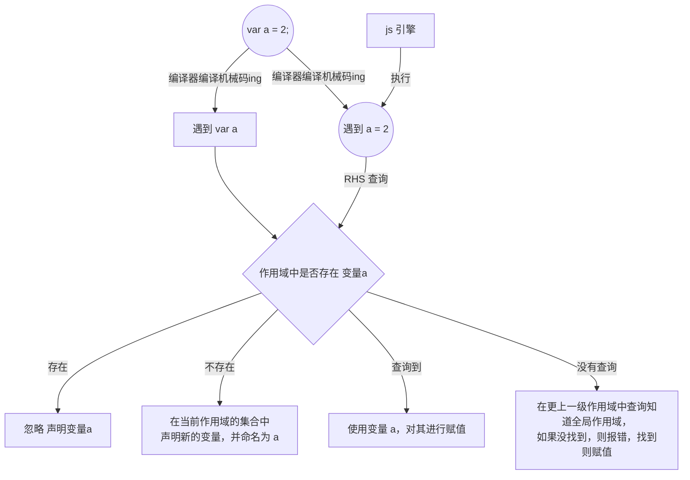

[TOC]

# 一. 编译原理
## 传统语言对代码编译分为几个步骤？它们的具体内容是什么？
- 分词/词法分析（Tokenizing/Lexing）
    &emsp;&emsp;我们书写的代码都是一堆由`字符`组成的`字符串`。在 这一阶段，会将这些字符串分解成 对编程语言有意义的代码块，这些代码块被称为 `词法单元(token)`。
    &emsp;&emsp;比如， `var a = 2;`，会被分解为词法单元 `var` `a` `=` `2` `;`。空格是否有意义，取决于使用的编程语言.。      
    > **分词(tokenizing) 和 词法分析(Lexing) 有什么区别？**
    >>~~emm....,一知半解，还不太懂。~~ 
    啥子有状态、无状态解析规则。
    生成词法单元，使用的是有状态的解析规则，叫做词法分析。
    反之，应该就叫做 分词了吧。

    ```mermaid
    graph TB
    code["var a = 2;"]
    token["var、a、=、2、;"]
    code -->|"分词/词法解析(tokenizing/Lexing)"| token
    ```
- 解析/语法分析(Parsing)
    &emsp;&emsp;将词法单元流(数组)转换成一个由元素逐级嵌套所组成的“抽象语法树”（Abstract Syntax Tree, AST）;
    比如： `var a = 2;` 的 AST 中可能会有一个叫做 `VariableDeclaration` 的顶级节点，接这是一个叫做 `Identifier（值是a）` 的子节点，以及一个叫做 AssignmentExpression 的子节点。AssignmentExpression 节点有一个叫做 NumericLiteral 的子节点。

    ```mermaid
    graph TB

    title["var a = 2; 的抽象语法树"]
    title-->VariableDeclaration
    style title fill:#FFF,stroke:#FFF
    linkStyle 0 stroke:#FFF,stroke-width:0;
    VariableDeclaration["VariableDeclaration (var)"] --> Identifier["Identifier (a)"]
    VariableDeclaration --> AssignmentExpression["AssignmentExpression (=)"] --> NumericLiteral["NumericLiteral (2)"]
    ```
- 代码生成
    &emsp;&emsp;将 AST 转换成可执行的代码。这个过程与 语言、目标平台息息相关。
    &emsp;&emsp;举例，将 `var a = 2;`的 AST 转换为 一组机器指令，用来创建一个叫做a 的变量(包括分配内存)，并将一个值储存在a中。
    ```mermaid
    graph TD
    code["var a = 2; 的抽象语法树"]
    machine["机器指令"]
    execute["创建变量 a，将2储存到 a 中"]
    code -->|"代码生成"| machine -->|js引擎| execute
    ```

    **编译步骤:**
    ```mermaid
    graph TD
    code(("一段代码"))
    finish(("结束"))
    token["词法单元"]
    abs["抽象语法树(AST)"]
    machine["机器指令"]
    code --"分词/词法分析(tokenizing)"-->token
    token --"解析/语法分析（Parsing）"-->abs
    abs --"代码生成"-->machine
    machine --"js 引擎执行代码操作"-->finish
    ```    

## javascript 引擎对代码的编译大概过程是怎样的？
&emsp;&emsp;JavaScript 引擎要比较复杂,在语法分析和代码生成阶段有特定的步骤来对运行性能进行优化，包括对冗余元素进行优化等。
&emsp;&emsp;Javascript编译代码发生在代码执行前的几微秒的时间内。JavaScript 编译器首先会对 var a = 2; 这段程序进行编译，然后做好执行它的准备，并且通常马上就会执行它。
# 二 理解作用域
## 对 js 代码的编译执行，需要那几个部分(比如 js 引擎)的通力协作？
- 引擎
    负责整个 javascript编译和执行过程。
- 编译器
    负责语法分析和代码生成
- 作用域
    1. 负责收集并维护由所有声明的标识符（变量）组成的一系列查
询。
    2. 使用一套非常严格的规则，确定当前执行的代码对这些标识符的访问权限。
## js 引擎是如何"看待"代码的？
&emsp;&emsp;首先，编译器会将 代码 编译成对应的 机械码，并且会将变量存到作用域中(不会进行赋值)。js引擎执行代码时，在遇到需要使用的变量会去作用域中寻找。如果找到变量则进行相应的操作，找不到则会报错。
&emsp;&emsp;以js引擎对 `var a = 2;` 这段代码为例。

> 猜测： 编译器将代码执行成为机械指令以后，会先对其中的变量声明进行内存的分配及命名，然后 js引擎再执行其他的指令。
## 编译器的一些术语： LHS、RHS
LHS: 查找赋值的
RHS: 查找命名的变量空间，取值的操作。
> 我理解的大概就是这样。
### 引擎 和 作用域 之间如何协作的？

小测试
1\. 找到其中所有的 LHS 查询。（这里有 3 处！）
2\. 找到其中所有的 RHS 查询。（这里有 4 处！）
```js
function foo(a) {
    var b = ;
    return a + b;
}
var c = foo(2);
```

# 三 作用域的嵌套

# 四 异常

# 五 小结
